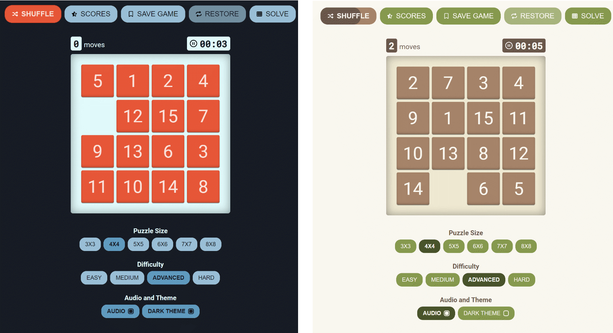

# Gem Puzzle

**Gem Puzzle** is a classic sliding puzzle game that challenges your spatial reasoning skills. It features a wide range of grid sizes and difficulty levels, making it a perfect game for players of all ages and skill levels.

## Features

- **Multiple Grid Sizes**: Choose from a range of grid sizes, including 3x3, 4x4, 5x5, 6x6, 7x7, and 8x8, to customize the game to your liking.
- **Difficulty Levels**: Play at the easy, medium, advanced, or hard difficulty levels, depending on your skill level and preferences.
- **Dark Mode**: The game features a dark mode that reduces eye strain and makes it easier to play in low-light conditions.
- **Audio On/Off**: Turn on or off the game's audio to customize your experience.
- **Autosolve**: If you get stuck, use the autosolve feature to solve the puzzle automatically.

## Tech Stack

The game is built using the following technologies:

- **JavaScript ES6+**: The game is written in modern JavaScript that offers better readability, syntax, and performance.
- **Sass**: The app uses Sass, a powerful CSS preprocessor, that enables you to write maintainable and scalable CSS code.
- **Webpack**: The app uses Webpack, a popular bundler, that compiles JavaScript modules, CSS stylesheets, and other assets into a single bundle for deployment.

## Installation

To install and run the app on your local machine, follow these steps:

1. Clone the repository or download the source code.
2. Install the dependencies using `npm install`.
3. Start the development server using `npm start`.
